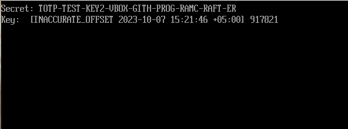

# totp-uefi
This is a TOTP implementation that is compiled into a single EFI file, that can be launched on a computer or in a virtual machine. Thus, it can be launched without an operating system. Works in ```no-std``` environment.
<br>Its other features are:
<ol>
  <li>Different key lengths are supported.</li>
  <li>Code is generated and updated instantly.</li>
  <li>Key is preserved across reboots (you can use build from commit 20f545d if you don't want this).</li>
</ol>


# Dependencies
<ul>
  <li>uefi, uefi-services</li>
  <li>totp-rs</li>
  <li>chrono</li>
  <li>base32</li>
  <li>sha1</li>
  <li>sha2</li>
</ul>

# License
